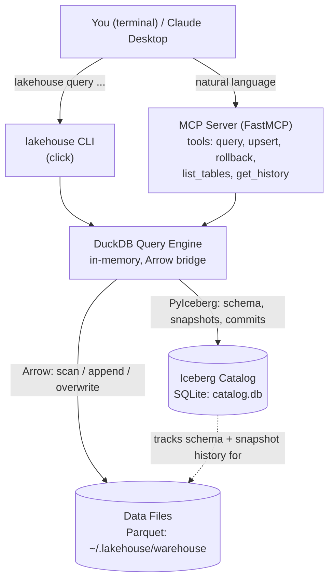

# Local Iceberg Lakehouse

[](https://github.com/thompgt/local-iceberg-lakehouse/actions/workflows/ci.yml)
[](https://github.com/thompgt/local-iceberg-lakehouse)
[](https://www.python.org/downloads/)
[](https://iceberg.apache.org/)
[](https://duckdb.org/)

## What is this?

**Apache Iceberg** is the table format behind most modern data lakehouses (Snowflake, Databricks, BigQuery all support it) — it gives you ACID transactions, schema evolution, and time travel on top of plain files. Normally, trying it out means standing up a Hive/REST/Glue **catalog service**, S3-compatible **object storage**, and often a **Spark cluster**, just to run a toy example.

**Local Iceberg Lakehouse swaps every one of those remote pieces for a local equivalent:**

| Instead of... | This project uses... |
|---|---|
| Hive / REST / Glue catalog | **SQLite** (a single `catalog.db` file) |
| S3 / MinIO object storage | **Your local filesystem** (`~/.lakehouse/warehouse`) |
| Spark cluster | **DuckDB**, bridged to Iceberg via Apache Arrow |

The result is a real, spec-compliant Iceberg lakehouse — with genuine ACID commits, snapshots, and rollback — that runs entirely on one machine with `uv sync` and no external services. That makes it useful for **learning how Iceberg actually works, prototyping data pipelines, or doing local/offline analytics**, without provisioning any cloud infrastructure. It also ships an **MCP server**, so an AI assistant like Claude can query, insert, and manage the data using natural language instead of hand-written SQL.

## Architecture



Two front doors (the `lakehouse` CLI and the MCP server) call into the same `CatalogManager` (`src/local_iceberg_lakehouse/catalog.py`) and `QueryEngine` (`src/local_iceberg_lakehouse/query.py`). `CatalogManager` wraps PyIceberg's SQL catalog (SQLite); `QueryEngine` owns an in-memory DuckDB connection that scans Iceberg tables to Arrow, runs SQL against them, and commits writes back as new Iceberg snapshots.

## Key Features

- **Local-First Architecture:** All data stays on your machine in `~/.lakehouse/warehouse`. No cloud costs, zero latency, total privacy.
- **Enterprise-Grade Storage:** Powered by **Apache Iceberg**, providing:
  - **ACID Transactions:** Reliable inserts and updates.
  - **Time Travel:** Query historical snapshots of your data.
  - **Rollbacks:** Instantly revert to a previous state if data is corrupted.
- **AI-Native (MCP):** A built-in MCP server lets AI assistants (like Claude) query, insert, and manage your data using natural language.
- **High Performance:** Uses **DuckDB** for analytical SQL processing, capable of handling millions of rows on a standard laptop.
- **Standardized:** Uses industry-standard **Parquet** files for maximum compatibility with other data tools.

---

## Getting Started

### Prerequisites

- Python 3.13+
- [uv](https://github.com/astral-sh/uv) (Modern Python package manager)

### Installation

Clone the repository and sync dependencies:

```bash
git clone https://github.com/thompgt/local-iceberg-lakehouse.git
cd local-iceberg-lakehouse
uv sync
```

---

## Usage

### 1. CLI Interface

The `lakehouse` command manages the lakehouse. Below is a real transcript — every command was actually run against a temporary local warehouse (`create-sample-table`, `list-tables`, and `query` are exercised via the CLI itself; `append`/`upsert`/snapshot history go through the same `CatalogManager`/`QueryEngine` classes the CLI and MCP server both call, since the CLI doesn't expose write/history subcommands yet):

```console
$ uv run lakehouse create-sample-table
Created table default.people

$ uv run lakehouse list-tables
default.people

$ uv run lakehouse query default.people --sql "SELECT * FROM people WHERE id > 0"
Empty DataFrame
Columns: [id, name]
Index: []
```

The table exists but is empty — writes currently go through `QueryEngine` directly (this is also what the MCP `upsert` tool calls):

```python
>>> import pandas as pd, pyarrow as pa
>>> from local_iceberg_lakehouse.catalog import CatalogManager
>>> from local_iceberg_lakehouse.query import QueryEngine
>>> cm = CatalogManager()
>>> qe = QueryEngine(cm)
>>> df = pd.DataFrame({"id": [1, 2, 3], "name": ["Alice", "Bob", "Charlie"]})
>>> qe.append_data("default.people", pa.Table.from_pandas(df))  # commits a new Iceberg snapshot
```

Querying again through the CLI now returns the appended rows:

```console
$ uv run lakehouse query default.people --sql "SELECT * FROM people WHERE id > 0"
   id     name
0   1    Alice
1   2      Bob
2   3  Charlie
```

An upsert (`qe.upsert_data(...)`, the "Load-Merge-Overwrite" strategy described below) updates Bob and adds Diana, then `table.snapshots()` — the same PyIceberg API the MCP `get_history` tool uses — shows every commit so far:

```console
Upsert complete.

Snapshot history (table.snapshots(), same API as the MCP get_history tool):
  snapshot_id=8269263345160024750  timestamp_ms=1784477027683  operation=Operation.APPEND
  snapshot_id=5878145082937030369  timestamp_ms=1784477065798  operation=Operation.DELETE
  snapshot_id=1503258084241234900  timestamp_ms=1784477065855  operation=Operation.APPEND

$ uv run lakehouse query default.people --sql "SELECT * FROM people ORDER BY id"
   id     name
0   1    Alice
1   2    Bobby
2   3  Charlie
3   4    Diana
```

(The upsert overwrites the table via a `DELETE` snapshot immediately followed by an `APPEND` of the merged rows — see [Upsert Strategy](#upsert-strategy-load-merge-overwrite) below.) `rollback_to_snapshot(8269263345160024750)` would instantly revert the table back to just Alice/Bob/Charlie.

**Start the MCP Server:**
```bash
uv run lakehouse start-server
```

### 2. AI Assistant Integration (Claude Desktop)
To use this with Claude Desktop, add the following to your `claude_desktop_config.json`:

```json
{
  "mcpServers": {
    "lakehouse": {
      "command": "uv",
      "args": [
        "--directory",
        "/path/to/local-iceberg-lakehouse",
        "run",
        "lakehouse",
        "start-server"
      ]
    }
  }
}
```

Once connected, Claude can call `list_tables`, `get_table_schema`, `query`, `upsert`, `rollback`, and `get_history` directly — the same operations shown in the transcript above, driven by natural language instead of Python/CLI calls.

---

## Technical Design Decisions

### Storage: Parquet over Vortex
While the original inspiration used a custom "Vortex" format, this implementation utilizes **Standard Parquet**. This ensures that your data remains portable and can be opened by any modern data tool (Pandas, Polars, Spark, etc.) without proprietary dependencies.

### Catalog: SQLite
We use a **SQL Catalog (SQLite)** stored in `catalog.db`. This provides a lightweight but robust way to handle the metadata of your Iceberg tables locally, ensuring that schema changes and snapshots are tracked atomically.

### Upsert Strategy: Load-Merge-Overwrite
For local efficiency, updates are handled by:
1. Loading existing table data into an Arrow table.
2. Merging new records in DuckDB using SQL.
3. Overwriting the Iceberg table with the new consolidated state.
This ensures your storage is always perfectly compacted and optimized for reads.

---

## Testing

Run the suite of unit and integration tests:

```bash
uv run pytest
```

Want to walk through the same workflow interactively, cell by cell? See [`Demo.ipynb`](Demo.ipynb).

---

## License

MIT License. See [LICENSE](LICENSE) for details.
