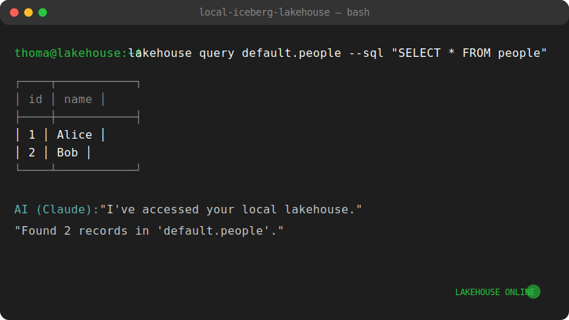

# Local Iceberg Lakehouse



A "local-first" data lakehouse implementation designed for privacy, speed, and AI-driven analytics.
 This project bridges the gap between structured enterprise-grade storage (**Apache Iceberg**) and Large Language Models (LLMs) via the **Model Context Protocol (MCP)**.

[](https://github.com/thompgt/local-iceberg-lakehouse/actions/workflows/ci.yml)
[](https://github.com/thompgt/local-iceberg-lakehouse)
[](https://www.python.org/downloads/)
[](https://iceberg.apache.org/)
[](https://duckdb.org/)

---

## 🌟 Key Features

- **Local-First Architecture:** All data stays on your machine in `~/.lakehouse/warehouse`. No cloud costs, zero latency, and total privacy.
- **Enterprise-Grade Storage:** Powered by **Apache Iceberg**, providing:
  - **ACID Transactions:** Reliable inserts and updates.
  - **Time Travel:** Query historical snapshots of your data.
  - **Rollbacks:** Instantly revert to a previous state if data is corrupted.
- **AI-Native (MCP):** Includes a built-in MCP server that allows AI assistants (like Claude) to query, insert, and manage your data using natural language.
- **High Performance:** Uses **DuckDB** for analytical SQL processing, capable of handling millions of rows on a standard laptop.
- **Standardized:** Uses industry-standard **Parquet** files for maximum compatibility with other data tools.

---

## 🏗️ Architecture

```text
┌─────────────────────────────────────────────────────────────────┐
│          LLM (Claude) / CLI Interface                           │
│          "Query my monthly expenses..."                         │
└─────────────────────────┬───────────────────────────────────────┘
                          │ MCP Protocol / CLI Commands
                          ▼
┌─────────────────────────────────────────────────────────────────┐
│          MCP Server / CLI Logic                                 │
│          Tools: query, upsert, list_tables, etc.                │
└─────────────────────────┬───────────────────────────────────────┘
                          │
                          ▼
┌─────────────────────────────────────────────────────────────────┐
│          DuckDB (Query Engine)                                  │
│          (In-memory execution with Arrow bridge)                │
└───────────────┬─────────────────────────┬───────────────────────┘
                │ PyIceberg               │ Arrow
                ▼                         ▼
┌──────────────────────────┐      ┌────────────────────────────────────┐
│      Iceberg Catalog     │      │          Data Files                │
│       (SQLite DB)        │      │       (Standard Parquet)           │
└──────────────────────────┘      └────────────────────────────────────┘
```

---

## 🚀 Getting Started

### Prerequisites

- Python 3.13+
- [uv](https://github.com/astral-sh/uv) (Modern Python package manager)

### Installation

Clone the repository and sync dependencies:

```bash
git clone https://github.com/thompgt/local-iceberg-lakehouse.git
cd local-iceberg-lakehouse
uv sync
```

---

## 💻 Usage

### 1. CLI Interface
The `lakehouse` command allows you to manage the lakehouse manually.

**Initialize a sample table:**
```bash
uv run lakehouse create-sample-table
```

**List available tables:**
```bash
uv run lakehouse list-tables
```

**Run a SQL query:**
```bash
uv run lakehouse query default.people --sql "SELECT * FROM people WHERE id > 0"
```

**Start the MCP Server:**
```bash
uv run lakehouse start-server
```

### 2. AI Assistant Integration (Claude Desktop)
To use this with Claude Desktop, add the following to your `claude_desktop_config.json`:

```json
{
  "mcpServers": {
    "lakehouse": {
      "command": "uv",
      "args": [
        "--directory",
        "/path/to/local-iceberg-lakehouse",
        "run",
        "lakehouse",
        "start-server"
      ]
    }
  }
}
```

---

## 🛠️ Technical Design Decisions

### Storage: Parquet over Vortex
While the original inspiration used a custom "Vortex" format, this implementation utilizes **Standard Parquet**. This ensures that your data remains portable and can be opened by any modern data tool (Pandas, Polars, Spark, etc.) without proprietary dependencies.

### Catalog: SQLite
We use a **SQL Catalog (SQLite)** stored in `catalog.db`. This provides a lightweight but robust way to handle the metadata of your Iceberg tables locally, ensuring that schema changes and snapshots are tracked atomically.

### Upsert Strategy: Load-Merge-Overwrite
For local efficiency, updates are handled by:
1. Loading existing table data into an Arrow table.
2. Merging new records in DuckDB using SQL.
3. Overwriting the Iceberg table with the new consolidated state.
This ensures your storage is always perfectly compacted and optimized for reads.

---

## 🧪 Testing

Run the suite of unit and integration tests:

```bash
uv run pytest
```

---

## 📜 License

MIT License. See [LICENSE](LICENSE) for details.
